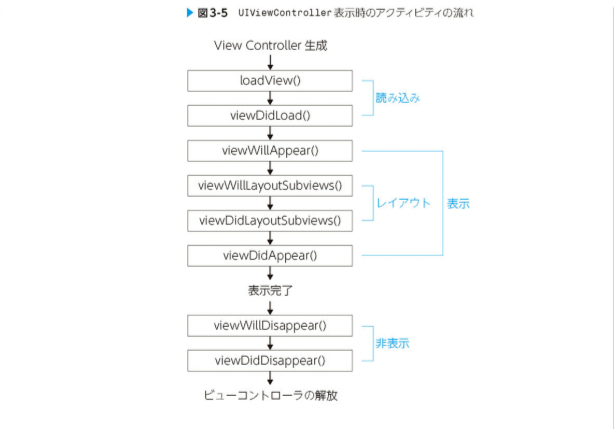

# UIViewControllerとレイアウトをサポートするクラス

## レイアウトの構造とプロセス

UIViewControllerはMVCモデルにおけるコントローラの役割を補っている
iOSアプリでは基本的に一画面に最低一つのVCが存在する
このVCはモデルとviewの媒介であり、ユーザーインタラクションを受けたり、
ある画面において必要となるモデル操作の指令を出したり、Viewに対してレイアウトを指示したりする
そのためVC自身はモデルのロジックを知りませんし、Viewにおいてどのようにレイアウトが実施されているかは知りません
しかし、コントローラーは媒介的な役割を持つので、そのライフサイクルはレイアウトされるオブジェクトたちに大きな影響を与える
Viewオブジェクト生成、制約計算、レイアウト、さらに画面回転などiOSアプリのレイアウトに関係する多くの要素はこのVCをを介して行われるため、レイアウトを深く知るには、VCの理解が不可欠である

### 表示に関わる階層構造 -スクリーン、ウィンドウ、VC

VCは、viewプロパティとしてついとなるViewを持っている
これは、VCのみによって画面に表示されているわけではない
複数の表示に関わるオブジェクトが、階層構造となることでディスプレイに表示されているのです
iOSアプリのViewはMacアプリと同様に、次のような階層構造になっている


### UIViewにおけるレイアウトのライフサイクル

各VCはついとなるUIViewを持っている
UIViewControllerのライフサイクルを理解するには、UIViewのレイアウトライフサイクルを知る必要がある

- 制約の更新
- フレームの更新
- レンダリング
  
#### 制約の更新

制約が変更されると、レイアウトにおけるコンポーネントの位置関係が変更されるので、その制約を満たすために、再計算がレイアウトエンジンのよって行われる、具体的にはUIViewのupdateConstrains()がよばれ、ボトムアップ（子Viewから親View）に制約の計算が実行される

制約の更新は、以下のような条件で引き起こされる

- 制約のactiveフラグによる有効化および無効化
- 制約の優先度変更
- 制約の追加や削除
- 制約を与えられたViewの階層変更

updateConstraints()をオーバーライドすることで、制約が更新するタイミングで独自の処理をつかすることができる
しかしこのメソッドがオーバーライドする必要がない
制約の変更が必要になるのは端末の回転やウインドウサイズの変更、オブジェクトの追加削除といったイベントが発生するタイミングであることが多いからである。
従って、そのイベントの記述に近い場所に制約の変更を記述した方が良いのは、制約更新において、パフォーマンスが十分でない場合がある
このメソッド内で制約を更新すると、レイアウトエンジンが複数の制約変更を特定のレイアウトパス中でバッチ処理できるため、制約を効率よく更新できる

開発者が制約の更新を明示的に実行することも可能、
updateConstrains()を直接呼ぶことはない。
代わりに、updateConstrainsIfNeeded()を呼ぶ

``` swift
self.updateConstraintsIfNeeded()
```

また、SetNeedsUpdateConstraints()
メソッドを呼ぶことでも、制約の更新ができる

このメソッドを呼ぶと、「制約を更新する必要がある」というフラグが立ち、
次のレイアウトパスで制約の再設計が実行される

updateConstraintsIfNeeded()とは違い、即座にupdateConstraints()が呼ばれるだけでなく、複数の箇所で制約を更新しても同じレイアウトパスで制約が更新されるため、少しパフォーマンスが良いのが特徴である

この辺もいろいろやりながら、覚えていくと良さそう

### フレームの更新

制約情報が更新されると、レイアウトを更新するために、レイアウトエンジンが計算した、フレーム情報をViewが受け取りLayoutSubViews()が呼ばれ、トップダウン
にフレームの更新が実施され、更新が必要であれば、制約も更新される
このフレームの更新を引き起こす条件の例として、次の物があげられる

- Viewのフレームが変更された時（端末が回転した時）
- サブビューが追加あるいは、削除された時
- UIScrollViewのサブクラスにおいて、contentOffSetが変更された時

レイアウトが必要なタイミングで、開発者が明示的にフレームの更新を実施することもできる

UIKitによるレイアウトは、スレットセーフではないため、メインスレッドでレイアウトメソッドを呼ぶ必要がある
このフレームの更新を実行するメソッド達は、制約の更新を実行するメソッドと比べるとよく使われる
LayoutSubViewsのオーバーライド

レイアウトの変更はlayoutSubViews()で実行されるため、このメソッドをオーバーライドすることで、制約付与によるレイアウトは難しいレイアウトでも実現できる
オーバーライドした際に、super.layoutSubViews()を実行する時点ですでに制約は更新される、
そのレイアウト情報を用いて処理を実行したい場合に有効
layoutSubViews()は、通常のレイアウトパスで、updateConstrains()と共に、バッチ処理的にレイアウトの変更を行うので、メインスレッドをブロックせずに、レイアウトの変更が実施できる

### レンダリング

レイアウトライフサイクルの３つ目のステップは、更新されたフレーム情報のレンダリング
フレーム情報が更新されたあと、ディスプレイに変更を表示するために、drawRect()メソッドが呼ばれる

iOSにおいては、drawRect()がそれぞれのViewを一度だけオフスクリーンバッファに描画する、描画されたレイヤーは、それぞれ独立した矩形となる
明示的にフラグを立てない限り、単純なオブジェクトの移動や、拡大縮小では再描画されない

再描画が必要な矩形は、drawRect()がグラフィックコンテクストを引数として、受け取り、描写処理を実行する
タイミングはAppleのiOS描画及び、印刷ガイドによると次の条件となる

- Viewの一部を隠している別のViewの移動または除去
- Hidden(非表示)になっていたViewの再表示（プロパティをNOに設定）
- Viewを画面外までスクロールし、際画面内に戻す
- ViewのSeetNeedDisplayメソッドまたはsetNeedsDisplayInRect()メソッドの明示的な呼び出し

drawRect()を直接呼び出すことはなく、setNeedDisplay()またはsetNeedsDisplayInRect()を呼び出すことで
再描画のトリガを与え実行する

タイマーを用いて一秒間に複数回レンダリングすることで、アニメーションにすることもできる

## ViewControllerのライフサイクル



詳細
VCが生成され画面に表示される段階になると、Viewの読み込みが始まる
Viewの呼び込みはloadView()で行われ、完了するとviewdidLoad()が呼ばれる、
次にVCは表示を開始し、viewWillAppear()を飛び出す
その後、レイアウトを実施しるviewWillLayoutSubViews()
が呼ばれることで、フレームの更新が、実施された後にviewDidLayoutSubViews()が呼ばれ、レイアウトが完了したことを通知する
最後にviewDidLayoutSubView()が呼ばれ、レイアウトが完了したことを通知する
最後にレイアウトされたviewが表示されるとviewDidAppear()が呼ばれて画面への表示が完了する

画面遷移をしたり、アプリを閉じたり、した時に呼ばれるのが、VCの非表示プロセス
VCが画面から消える直前にviewWillDisAppear()が呼ばれ、画面遷移が完了してVCがスクリーン常に表示されなくなった時、
viewDidDisapperが呼ばれる

### loadView()

Viewをメモリ上へ読み込み、対象のポインタと関連付けを行うメソッド
UIViewContrillerのメソッドを読んだタイミングで、つまりsuper.loadView()を読んだタイミングで、
UIViewControllerのViewプロパティにViewがセットされる

Storyboardが存在するときは、Storyboard上で定義された、Viewが生成され、viewプロパティに代入される
viewの読み込みに特別な操作を必要としない場合、特にオーバーライドする必要はない

一方、Storyboardを用いずにカスタムviewを定義している場合は、loadview()をオーバーライドし、
レイアウトを定義することができる

storyboardを用いたときは、親クラスが自動的にviewを生成しているが、この場合は開発者がviewを生成し、
viewプロパティに代入する必要がある、storyboardを用いない場合はsuper.loadview()を呼ばない方がメモリー効率が高くなる

### vieDidLoad()

loadView()が完了したときに呼ばれるメソッドで、オーバーライドを用いる
通常のメソッドでは、loadview()で読み込みが完了したUIオブジェクトにプロパティをセットしたり追加したり、
追加の処理を実行したりする

このメソッドはviewの読み込みが完了したタイミングで一度だけ呼ばれるため、クラス内で用いる値やオブジェクトを初期化する処理の
記述に適している

### viewWillApper()

viewが表示される直前に呼ばれるメソッドで、オーバーライドして用います
このメソッドは表示される直前であれば、いつでも呼ばれるため、メモリ上に存在する既に表示したviewが再度表示される際
にも同様に挙動をする

例えば、バックグラウンドからアプリを開き直した場合や、UIViewControllerにおけるタブの切り替えが当てはまる
表示の度に呼ばれるので、動的なセットに向いている
ただし、この段階ではUserにUI提供されていないため、計算コストが高い処理は避けた方が良い

### viewWillLayoutSubViews()

viewのレイアウトが開始するときに呼ばれるメソッドで、このときに実行したい処理がある場合は、オーバーライドして用いる
このメソッドは、viewControllerが読み込まれたあとだけではなく、端末の回転やviewの再表示などによって、viewが新しい大きさに変わった時に必ず呼ばれる

この時点では、サブviewのレイアウトは決定されていませんが、画面の向きは決定している
あまり推奨しないが、AutoLayout使用時に、画面の状態によって制約に変更を与えたい場合は、回転時に呼び出されるデリゲートメソッドではなく、このメソッド内で、変更を実施することもある

viewWillLayoutSubViewsが呼ばれたあと、VCのレイアウトが開始される、
このタイミングでは、UIviewのレイアウトサイクルでいうところの制約の更新とフレームの更新を実施される

### ViewDidLayoutSubviews()

viewのレイアウトが完了した時に呼ばれるメソッドで、この時に実行したい処理がある場合は、オーバーライドして用いる
UIViewのレイアウトサイクルにおける、layoutSubviews()によるフレームの更新が既に実施されているため、この時点では
VCの持つview内のレイアウトが確定する

### ViewDidAppear()

viewが表示された直後に呼ばれるメソッドで、オーバーライドして用いる
UIViewレイアウトサイクルの最後のステップであるレンダリングが終わったタイミングに当たる
表示開始のメソッドviewWillAppear()と対になっているため、バックグラウンドから復帰したときや、
UITabViewControllerにおけるタブの切り替え時などにもこのメソッドは呼ばれる、
既にUIがUserに提供されているため、User体験に直接影響を与えない処理を実行することが多い

## UIWindow

UIWindowはviewを管理し、ディスプレイに表示するウインドウの役割を担っている
UIWindowは、タッチイベン、トフォーカス、座標変換に関して特別な機能が追加されたUIViewのサブクラス
ウィンドウは以下のようにキーウィンドウとなることで、これらの入力を受け付けることができる

このUIWindowは一つのアプリ上で複数表示できる
