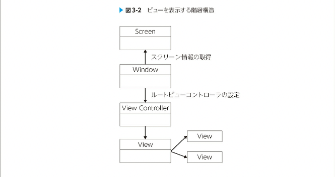

# UIViewControllerとレイアウトをサポートするクラス

## レイアウトの構造とプロセス

UIViewControllerはMVCモデルにおけるコントローラの役割を補っている
iOSアプリでは基本的に一画面に最低一つのVCが存在する
このVCはモデルとviewの媒介であり、ユーザーインタラクションを受けたり、
ある画面において必要となるモデル操作の指令を出したり、Viewに対してレイアウトを指示したりする
そのためVC自身はモデルのロジックを知りませんし、Viewにおいてどのようにレイアウトが実施されているかは知りません
しかし、コントローラーは媒介的な役割を持つので、そのライフサイクルはレイアウトされるオブジェクトたちに大きな影響を与える
Viewオブジェクト生成、制約計算、レイアウト、さらに画面回転などiOSアプリのレイアウトに関係する多くの要素はこのVCをを介して行われるため、レイアウトを深く知るには、VCの理解が不可欠である

### 表示に関わる階層構造 -スクリーン、ウィンドウ、VC

VCは、viewプロパティとしてついとなるViewを持っている
これは、VCのみによって画面に表示されているわけではない
複数の表示に関わるオブジェクトが、階層構造となることでディスプレイに表示されているのです
iOSアプリのViewはMacアプリと同様に、次のような階層構造になっている



### UIViewにおけるレイアウトのライフサイクル

各VCはついとなるUIViewを持っている
UIViewControllerのライフサイクルを理解するには、UIViewのレイアウトライフサイクルを知る必要がある

- 制約の更新
- フレームの更新
- レンダリング
  
#### 制約の更新

制約が変更されると、レイアウトにおけるコンポーネントの位置関係が変更されるので、その制約を満たすために、再計算がレイアウトエンジンのよって行われる、具体的にはUIViewのupdateConstrains()がよばれ、ボトムアップ（子Viewから親View）に制約の計算が実行される

制約の更新は、以下のような条件で引き起こされる

- 制約のactiveフラグによる有効化および無効化
- 制約の優先度変更
- 制約の追加や削除
- 制約を与えられたViewの階層変更

updateConstraints()をオーバーライドすることで、制約が更新するタイミングで独自の処理をつかすることができる
しかしこのメソッドがオーバーライドする必要がない
制約の変更が必要になるのは端末の回転やウインドウサイズの変更、オブジェクトの追加削除といったイベントが発生するタイミングであることが多いからである。
従って、そのイベントの記述に近い場所に制約の変更を記述した方が良いのは、制約更新において、パフォーマンスが十分でない場合がある
このメソッド内で制約を更新すると、レイアウトエンジンが複数の制約変更を特定のレイアウトパス中でバッチ処理できるため、制約を効率よく更新できる

開発者が制約の更新を明示的に実行することも可能、
updateConstrains()を直接呼ぶことはない。
代わりに、updateConstrainsIfNeeded()を呼びかける

``` swift
self.updateConstraintsIfNeeded()
```
