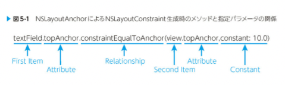
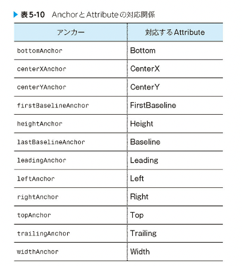

# コードとAuto Layout

IBを使わない場合のAutoLayoutの方法

## 制約の生成

NSLayoutConstraintとNSLayoutAnchorがある
後者が主に使われているため後者のみ書く
前者は古い

### NSLayoutAnchor

利点

- リーダブルである、自然言語のようにCodeをかける
- メソッドチェーンすることができ

Code例

``` swift

let constraint1 = textField.topAnchor.constraintEqualTopAnchor(view.topAnchor, constant: 10.0)
let constraint2 = textField.widthAnchor.constraintEqualToConstant(20.0)

```



### アンカー、　Viewを固定する対象

- 上の例で登録するtopAnchorやwidthAnchorに含まれる「Anchor」とは？
  - オブジェクト内で固定する対象を指定し、指定した箇所に対して制約を生成する役割がある

オブジェクト内で固定する対象はAttributeという形で表され、このAttributeの性質に合わせてNSLayoutConstraintを生成させるためのクラスであるNSLayoutAnchorを継承した以下の３つのクラスが定義されている

- NSLayoutDimension
- NSLayoutXAxisAnchor
- NsLayoutYAxisAnchor

### NSLayoutAnchorの取得

NSLayoutAnchorを用いた制約の生成は、NSLayoutConstraiontを直接生成するのではなく、
UIViewからNSLayoutAnchorのサブクラスを取得し、このNSLayoutAnchorのサブクラスがNSLayoutConstraintを生成する



### NSLayoutAnchorで制約を生成する

UIViewから取得したNSLayoutAnchorのサブクラスから制約を生成することは、継続元であるNSLayoutAnchorで定義されているNSLayoutCinstraintを生成するためおのメソッド群を用います
このメソッド群は、以下のようにメソッド名としてRelationship(=, ≧、≦のいずれか)を持ち、
設定する、制約定数を引数として、渡すことができる

## 制約を有効化する

Codeで制約を追記したあと、その制約をレイアウトに対して有効にする必要がある
現在は有効化する方法

## 制約

### 制約の有効化

NSLayoutConstraiontのactiveプロパティをtrueに有効化する
制約自体は有効化されると、自動的に対象となるオブジェクトの共通の祖先Viewに対して追加される

例

``` swift

textField.topAnchor.constraintEqualTopAnchor(view.topAnchor).active = true

```

### 制約の無効化

``` swift

textField.topAnchor.constraintEqualTopAnchor(view.topAnchor).active = false //

```

###　制約の編集

レイアウト変更をするときは、制約を追加削除する他に、既存の制約を編集することができる
制約定数を変更することで実行される
基本的には制約を追加、削除すると、レイアウトエンジンが再計算を実施するため、計算コストが高くなる
基本的にレイアウトに大きな変更がない限りは制約定数を編集することをおすすめする

UIViewのconstraintsプロパティから制約の配列の取得をして、目的の制約を探すか、プロパティとして制約への参照を持ち続けるかどちらかが基本となる

## 空間の定義　UILayoutGuide(iOS 9.0 ~)

レイアウトエンジン上で表現される四角形のエリアを作る
制約のみでは解決できないレイアウトを実現するサポートをしてくれる
空間の定義ができる

以下プロパティを持つ

- identifier: 他のレイアウトガイドと区別するための名前
- layoutFrame: このレイアウトガイドフレームを返す
- owningView: このレイアウトガイドを持つのView
- 各種のNSLayoutAnchorプロパティ

## まとめ

- Codeで制約を生成する場合、最も基本的なイニシャライザのinit(item: attribute:relatedBy: toItem: attribute: multiplier: cnstant:)メソッド意外に、Visual Format Language(VFL)を用いる方法と、NSLayoutAnchorを用いる方法がある
- 基本的にはNSLayoutAnchorが使ってリーダブルなCodeをかく
- レイアウトガイドを用いると、通常の制約のみでは、定義できないレイアウトを定義できる。
