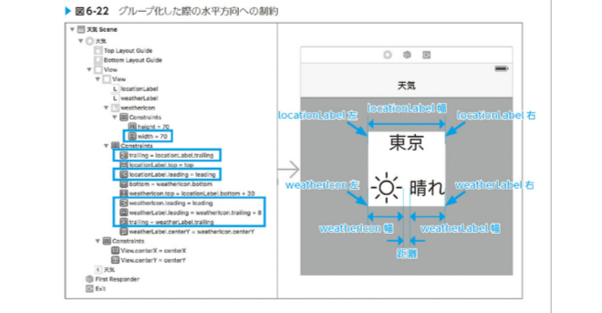
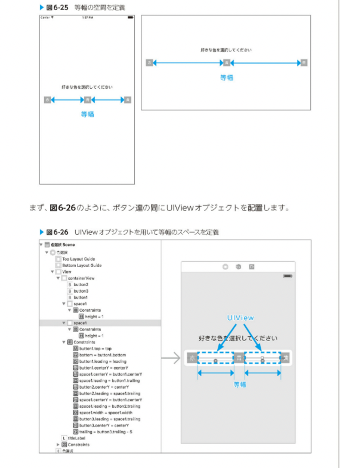

# 実装基本パターン

基本的なレイアウトを紹介していく
実際のプロジェクトに適用するうえで必要な知識をカバーしながら、どのように適用すれば良いか紹介する

## レイアウトに必要な制約の数

あるviewオブジェクトに対してレイアウトを確定するには、一方向につき基本的に２つの制約が必要
これらのRelationshipは.Equalである必要がある

あるオブジェクトに水平方向の制約を設定する場合、オブジェクトの左側、オブジェクトの幅、オブジェクトの右側の三箇所に制約を設定することができる
垂直方向であれば、上部、高さ、下部の三箇所


また　intrinsic Content Size を持つオブジェクトであれば、その大きさに合わせてサイズの制約としてNSContentSizeLayoutConstraintが自動的に付与される
水平方向と垂直方向それぞれについて、他のオブジェクトとの位置関係の制約を一箇所定めるだけで十分となる

## ビューオブジェクト単体のパターン

### 固定サイズパターン


### 画面サイズに合わせて変化するパターン


#### 固定サイズパターンとの組み合わせ


### コンテンツのサイズに合わせてレイアウトするパターン


### 比率で配置するパターン


#### 二つのオブジェクトのサイズ比率を用いる方法




### 同一幅のオブジェクトパターン


### 等間隔で並ぶオブジェクトパターン



##　トルツメパターン

「トルツメ」とは不要なインターフェースオブジェクトを削除して、そのスペースを詰めることを意味する

ユーザーのプロフィールにおける任意項目など、レイアウトしたいオブジェクトがオプショナルな値を持つ時などに用いられる

### 失敗パターン


上記のラベルだけを消したいが、トルツメ失敗すると以下のように消えてしまう


関連した制約も消えてしまうためこうなる

hiddinなら見えなくなるだけ
これだと隙間が空いてしまう


### オブジェクトを取り除ける場合のトルツメ

トルツメする場合は、取り除ける場合とそうでない場合がある

オブジェクトを再度利用する可能性がない場合は以下の方法でトルツメするとより良い実装になる


優先度が低い制約を定義する
上記の状態で

``` swift

self.label.removeFrowSuperView()
```

を実行すると、ラベルとラベルに関する制約はviewから削除される
その代わり、イメージビューとボタンの間にある
優先度が低い制約が残っているためレイアウトが保たれる

### オブジェクトを取り除けない場合のトルツメ

再利用を前提としていたり、状態変化にオブジェクトの表示非表示が変わるような場合は、オブジェクトを取り除かずトルツメする


上記の場合はまだ制約を調整する必要があるので、

``` swift

constant = 0
```

とすることで、制約の距離もなくなり、ラベルのトルツメもできる

ちなみに

``` swift

label.active = false
```

とすると、レイアウトは崩れる
この制約は他のオブジェクトのレイアウトにも影響を与えており、無効化してしまうと影響を受けるオブジェクトのレイアウトが崩れてしまうのでおすすめできない

#### UIImageViewの場合

``` swift

imageView.image = nil 
```

この後、マージンを調整してイメージビューのトルツメができる

これはあまり必要ない知識かもしれない

## 動的なスクロール領域を持つUIScrollViewのパターン

### Auto Layoutにおけるスクロール領域指定

オートレイアウトでやる場合は、Code書かなくてもできる
UIScrollViewオブジェクトのViewの内部から制約を与え、適切なcontentSizeを与えるというもの


### 例


## UIStackViewを使う


