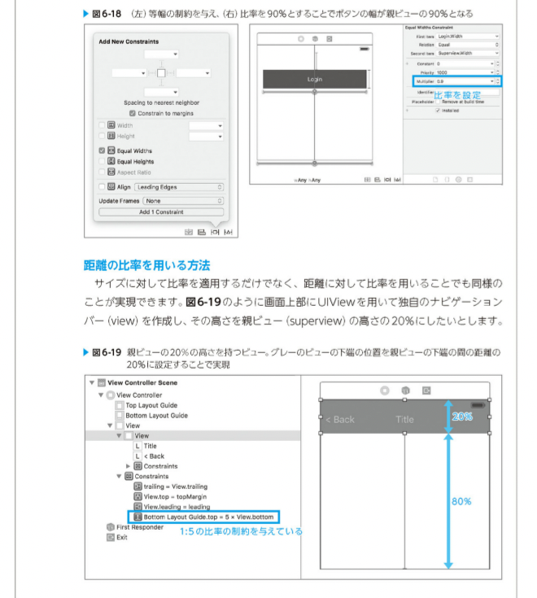

# 実装基本パターン

基本的なレイアウトを紹介していく
実際のプロジェクトに適用するうえで必要な知識をカバーしながら、どのように適用すれば良いか紹介する

## レイアウトに必要な制約の数

あるviewオブジェクトに対してレイアウトを確定するには、一方向につき基本的に２つの制約が必要
これらのRelationshipは.Equalである必要がある

あるオブジェクトに水平方向の制約を設定する場合、オブジェクトの左側、オブジェクトの幅、オブジェクトの右側の三箇所に制約を設定することができる
垂直方向であれば、上部、高さ、下部の三箇所

また　intrinsic Content Size を持つオブジェクトであれば、その大きさに合わせてサイズの制約としてNSContentSizeLayoutConstraintが自動的に付与される
水平方向と垂直方向それぞれについて、他のオブジェクトとの位置関係の制約を一箇所定めるだけで十分となる

## ビューオブジェクト単体のパターン

### 固定サイズパターン

### 画面サイズに合わせて変化するパターン

#### 固定サイズパターンとの組み合わせ

### コンテンツのサイズに合わせてレイアウトするパターン

### 比率で配置するパターン

#### 二つのオブジェクトのサイズ比率を用いる方法

### 同一幅のオブジェクトパターン

### 等間隔で並ぶオブジェクトパターン

##　トルツメパターン

「トルツメ」とは不要なインターフェースオブジェクトを削除して、そのスペースを詰めることを意味する

ユーザーのプロフィールにおける任意項目など、レイアウトしたいオブジェクトがオプショナルな値を持つ時などに用いられる

### 失敗パターン

上記のラベルだけを消したいが、トルツメ失敗すると以下のように消えてしまう

関連した制約も消えてしまうためこうなる

hiddinなら見えなくなるだけ
これだと隙間が空いてしまう

### オブジェクトを取り除ける場合のトルツメ

トルツメする場合は、取り除ける場合とそうでない場合がある

オブジェクトを再度利用する可能性がない場合は以下の方法でトルツメするとより良い実装になる

優先度が低い制約を定義する
